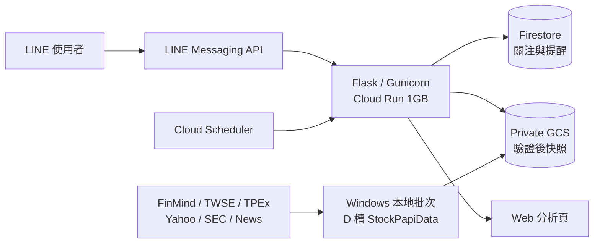

# Stock Papi

Stock Papi 是一套以 LINE 為主要入口的台股／美股量化分析系統。它把五日方向預測、歷史回測、技術面、籌碼、新聞情緒與產業脈絡整理成容易判讀的 LINE 卡片；需要深入研究時，再連到 Web 查看完整圖表與分析依據。

專案的核心原則很簡單：**LINE 負責操作，Web 負責分析，重運算留在本地。** 這個分工讓使用者不必建立第二套帳號，也讓 1GB RAM 的 Cloud Run 保持低記憶體、低冷啟動負擔。

> 本專案僅供研究、教學與模型驗證，不構成投資建議。預測機率與歷史績效不代表未來報酬。

## 使用體驗

| 入口 | 適合做什麼 |
| --- | --- |
| LINE Bot | 查股票、看產業預測、加入關注、設定／取消提醒、查看強勢訊號、試算投資金額 |
| Web | 查看互動 K 線、模型解讀、回測、籌碼、情緒拆解、MOPS、ETF 持倉與台美日供應鏈 |
| 本地批次 | 跑全市場資料、回測、產業洞察與快照發布，不占用 Cloud Run 記憶體 |

Web 服務：<https://line-stock-bot-1067991373149.asia-east1.run.app>

## 主要功能

### LINE Bot

- 支援台股代碼、公司名稱與標準美股代碼，例如 `2330`、`台積電`、`AAPL`、`NVDA`。
- 回覆最新收盤資料、未來五個交易日上漲機率、趨勢、情緒與風險提示。
- 六格 Rich Menu：看大盤、找機會、查自選、設提醒、算報酬、深度分析。
- 關注清單與提醒保存在 Firestore，依 LINE userId 隔離。
- 支援收盤價門檻、模型機率與趨勢提醒，可直接由按鈕管理或取消。
- 投資試算會估算可買股數、策略歷史損益與買進持有結果。
- Papi 可用自然語句回答股票與產業問題；資料不足時會明確降級，不編造即時數據。

### Web 分析

- `/dashboard`：市場摘要、產業熱力圖、產業預測與精選標的。
- `/stock/<code>`：互動 K 線、五日預測、技術指標、回測、法人籌碼、情緒與新聞。
- `/market`：台股大盤分析。
- `/market-map`：產業強弱、上市／上櫃 MOPS、ETF 前十大持倉與台美日供應鏈角色。
- 行動版與桌面版共用響應式介面；網站不建立第二套關注清單或提醒狀態。

### 全市場本地量化

- 台股涵蓋上市、上櫃標的；美股 universe 取自 SEC 官方 ticker／exchange 清單。
- 逐檔建立 730 日特徵、五日預測、walk-forward 回測與 gzip JSON 快照。
- 台股與美股使用獨立 checkpoint，可中斷續跑且不互相覆蓋。
- 單檔失敗會隔離記錄；全市場失敗率低於 5% 仍可發布，缺漏個股由 Cloud Run 即時計算。
- 快照採 SHA-256、內容定址物件、immutable manifest 與原子 `latest` 指標，避免讀到半套資料。
- MOPS、ETF 持倉、產業地圖與供應鏈聯動都在本地產生；Cloud Run 只驗證並讀取成品。

## 模型與資料

預測目標是「未來五個交易日方向」，核心模型為 LightGBM binary classifier，驗證採時間序列切分並保留五日 gap，避免未來資料洩漏。回測使用五日報酬並扣除估計交易成本。

主要特徵包括：

- 價格與技術面：MA、RSI、MACD、KD、波動率、成交量變化。
- 籌碼：外資／法人買賣超、融資融券變化。
- 市場風險：VIX、VIX9D、VIX3M 與期限結構。
- 情緒：新聞方向、強度、動能、分歧、來源覆蓋、時間衰減與資料完整度。
- 資料品質：跨來源價差、缺漏旗標與資料新鮮度。

| 類型 | 來源 |
| --- | --- |
| 台股價格與籌碼 | FinMind、TWSE、TPEx、twstock、yfinance |
| 美股價格與市場資料 | yfinance、SEC ticker／exchange 清單 |
| 新聞與輿論 | Google News RSS、選用 MarketAux、StockTwits 公開彙總 |
| 公司重大訊息 | TWSE／TPEx MOPS OpenAPI |
| ETF 持倉 | yfinance，本地失敗時保留前版 |
| 生成式摘要 | Google Gemini |

情緒與籌碼是輔助因子，不會直接覆蓋模型機率。缺資料時使用中性值與缺漏旗標，而不是用未來資料回填。

## 系統架構



Cloud Run 不在模組載入階段抓資料或訓練模型。Webhook 保持輕量，讓 scale-to-zero 後的第一則 LINE 訊息仍能盡快回覆。

## 專案結構

| 路徑 | 用途 |
| --- | --- |
| `app.py` | Gunicorn `app:app` 入口與舊測試相容門面 |
| `stock_papi/web/app_factory.py` | 建立彼此獨立的 Flask instance；啟動時不刷新雲端憑證 |
| `stock_papi/web/route_registration.py` | 集中註冊所有公開 route，保留既有 URL、endpoint 與 method |
| `stock_papi/web/routes/` | Dashboard、system、report、market 與 stock HTTP adapters |
| `stock_papi/application.py` | 過渡 compatibility exports 與 process-level runtime 組裝；不得再加入 route 或核心演算法 |
| `stock_papi/settings.py` | 輕量環境設定與非模型限制值 |
| `stock_papi/shared/` | 無 Flask／網路副作用的格式化、驗證與安全 logging helper |
| `stock_papi/repositories/` | GCS、report、quant snapshot 與 market-insight 的驗證讀取邊界 |
| `stock_papi/services/` | Dashboard、市場、情緒與個股分析 orchestration |
| `stock_papi/quant/` | 特徵、資料整形、模型、回測與投資試算；重型套件維持 lazy import |
| `stock_papi/integrations/line/` | Webhook routes、event handlers、notifications 與 Flex presentation |
| `stock_papi/integrations/market_data/` | FinMind、Yahoo Finance、TWSE／TPEx provider adapters |
| `stock_papi/integrations/news/` | 外部新聞 provider 與 schema normalization |
| `line_state.py` | Firestore 狀態、關注與提醒規則 |
| `market_insights.py` | MOPS、ETF、產業與供應鏈資料正規化 |
| `local_quant.py` | 本地全市場批次、checkpoint、快照與發布 |
| `templates/`、`static/` | Web UI、互動圖表與響應式樣式 |
| `assets/rich-menu.*` | LINE Rich Menu 設計稿與上傳圖片 |
| `scripts/` | Windows 排程安裝、批次執行與 GCS 上傳 |
| `tests/` | `unittest` 測試 |
| `Dockerfile` | Cloud Run 容器設定 |

## 快速開始

需求：Python 3.10、LINE Messaging API channel，以及可選的 GCP／FinMind／Gemini 設定。

```powershell
git clone https://github.com/enzo9355/Stock-Papi.git
Set-Location Stock-Papi

python -m venv .venv
.\.venv\Scripts\Activate.ps1
pip install -r requirements.txt

$env:LINE_CHANNEL_ACCESS_TOKEN='your-token'
$env:LINE_CHANNEL_SECRET='your-secret'
python app.py
```

本機預設網址：<http://127.0.0.1:5000>

### 環境變數

| 變數 | 必要性 | 用途 |
| --- | --- | --- |
| `LINE_CHANNEL_ACCESS_TOKEN` | 必要 | LINE 訊息 API |
| `LINE_CHANNEL_SECRET` | 必要 | 驗證 webhook signature |
| `GEMINI_API_KEY` | 建議 | Papi 摘要與白話解讀 |
| `FINMIND_USER`、`FINMIND_PASSWORD` | 選用 | FinMind 登入與額度 |
| `GCP_PROJECT_ID` | 選用 | 啟用 Firestore 狀態 |
| `QUANT_SNAPSHOT_BUCKET` | 選用 | 私有 GCS 本地量化快照 |
| `REPORT_FONT_PATH` | 本地日報必要 | 可合法使用、支援繁體中文的 regular TTF 字型絕對路徑 |
| `REPORT_FONT_BOLD_PATH` | 本地日報必要 | 可合法使用、支援繁體中文的 bold TTF 字型絕對路徑 |
| `ALERT_TASK_TOKEN` | 選用 | 保護提醒排程端點 |
| `BROADCAST_TOKEN` | 選用 | 保護週報廣播端點 |
| `MARKETAUX_API_TOKEN` | 選用 | 第二新聞來源與情緒交叉驗證 |
| `OPENALICE_API_URL`、`OPENALICE_API_TOKEN` | 選用 | 外部研究服務；失敗時安全降級 |
| `HOST`、`PORT` | 選用 | 本機／Cloud Run 綁定設定 |

正式環境不要使用明文環境變數保存憑證。本專案以 Secret Manager 注入 LINE、Gemini、FinMind 與排程 token；金鑰不得提交到 Git。

## LINE 操作範例

| 輸入或按鈕 | 結果 |
| --- | --- |
| `2330`、`台積電`、`AAPL` | 查詢個股 |
| `今日盤勢` | 查看台股大盤 |
| `預測` | 開啟產業預測 |
| `我的關注` | 查看關注清單與強勢訊號 |
| `提醒管理` | 查看或取消提醒 |
| `投資試算` | 顯示快捷金額按鈕 |
| `試算 2330 100000` | 以 10 萬元試算 2330 |
| `完整分析` | 開啟 Web 儀表板 |

## 測試

```powershell
$env:LINE_CHANNEL_ACCESS_TOKEN='test'
$env:LINE_CHANNEL_SECRET='test'

python -m unittest discover -s tests -v
python -m compileall -q stock_papi
python -m py_compile app.py line_state.py local_quant.py market_insights.py
node --check static/app.js
git diff --check
```

### 漸進式模組化重構狀態

- 根目錄 `app.py` 已由 4,153 行縮減為 18 行，只保留 Gunicorn 入口與舊測試相容門面。
- 既有 20 個公開 route 的 URL、endpoint 與 HTTP method 維持不變；Flask application factory 可建立彼此獨立的 instance。
- Web、LINE、資料存取、外部整合、量化與共用工具已依責任移入 `stock_papi/`，重型分析套件仍採延遲載入。
- 目前 Windows Application Control 會阻擋 NumPy 與 PDF 測試所需的原生模組；本機測試結果為 358 項中 355 項通過。不要為了測試停用系統安全控制，完整驗證應改在允許這些已核准相依套件的 CI、Linux 或受控環境執行。

新增 route 時，先在 `stock_papi/web/routes/` 建立 registration function，再由 `stock_papi/web/route_registration.py` 明確註冊，並固定 endpoint name。新增業務協調放入 `stock_papi/services/`；外部 I/O 放入 `repositories/` 或 `integrations/`，不要再擴充 `stock_papi/application.py`。

`stock_papi/**/__init__.py` 必須保持輕量。pandas、numpy、sklearn、LightGBM、matplotlib、reportlab、pypdf 與 Gemini 只能在實際執行路徑延遲載入；可用下列命令檢查 cold start：

```powershell
python -c "import sys, app; heavy=('pandas','numpy','sklearn','lightgbm','matplotlib','reportlab','pypdf','google.generativeai'); assert not [name for name in heavy if name in sys.modules]"
```

根目錄 `app.py` 的 module alias 是過渡相容層，用來維持既有 `import app as stock_app` 與 `patch.object` 行為。`stock_papi/application.py` 只保留 process runtime 組裝、明確 dependency mapping 與薄 compatibility wrappers；實際業務邏輯位於 service、repository、integration、quant 與 web 模組。新 production code 不得反向 import 根目錄 `app.py`。

## 台股產業量化分析日報

日報只在 Windows 本地讀取已完成的 TW 快照、計算產業統計與回測並生成 PDF。Cloud Run 只讀取私有 GCS 中已驗證的 index 與 PDF，不會在 HTTP request、Flask 啟動或 LINE webhook 產生報告。

### 安裝本地報告環境

```powershell
python -m pip install -r requirements.txt
python -m pip install -r requirements-report.txt
```

PDF 字型不放進 Git。請指定本機合法存在、ReportLab 可內嵌且支援繁體中文的 TTF 字型：

```powershell
$env:REPORT_FONT_PATH='C:\Windows\Fonts\NotoSansTC-VF.ttf'
$env:REPORT_FONT_BOLD_PATH='C:\Windows\Fonts\NotoSansTC-VF.ttf'
$env:REPORT_TITLE_FONT_PATH='C:\Windows\Fonts\NotoSerifTC-VF.ttf'
```

若字型不存在、不可讀或無法內嵌，生成流程會失敗並保留上一份正式 `latest-TW.json`，不會輸出缺字方塊的正式報告。

舊版 TW manifest 若缺少 `uncompressed_size`，日報 loader 會維持拒絕。先執行一次性安全 migration；它不抓行情、不重訓模型、不修改舊 manifest，只有全部股票通過 SHA-256、壓縮大小、限額串流解壓與 schema／日期驗證後，才建立新 immutable manifest 並最後替換 latest：

```powershell
python -m reporting.migrate_quant_manifest `
  --root D:\StockPapiData `
  --market TW `
  --latest quant\v1\latest-TW.json `
  --dry-run

python -m reporting.migrate_quant_manifest `
  --root D:\StockPapiData `
  --market TW `
  --latest quant\v1\latest-TW.json
```

dry-run 輸出包含驗證成功／失敗數、最大壓縮大小、最大解壓大小與 manifest 日期；任一股票失敗時不更新 `latest-TW.json`。

### CLI

```powershell
python -m reporting.cli `
  --root D:\StockPapiData `
  --market TW
```

可選參數：`--output-dir`、`--font-path`、`--font-bold-path`、`--title-font-path`、`--dry-run`、`--report-date`。未指定 `--report-date` 時，報告交易日固定使用已驗證 manifest 的 `market_as_of`，不使用系統今天日期。`--dry-run` 只驗證真實快照與分析結果，不生成、不發布，也不以 sample data 補正式資料。

資料來源固定為：

```text
D:\StockPapiData\publish\quant\v1\latest-TW.json
D:\StockPapiData\publish\quant\v1\manifests\
D:\StockPapiData\publish\quant\v1\objects\
```

正式發布格式為：

```text
D:\StockPapiData\publish\reports\v1\
├── objects\<pdf_sha256>.pdf
├── metadata\<metadata_sha256>.json
├── index-TW.json
└── latest-TW.json
```

產業近期報酬採有效成分股等權平均，缺失值不補零。產業回測每五個台股交易日再平衡一次，只使用具有完整未來五日價格的歷史 OOS `AI_P`，`AI_P >= 60` 才等權持有，單次完整持有扣除 `0.585%`，禁止重疊；Sharpe 使用 `sqrt(252 / 5)` 年化。最新尚未實現的五日預測不納入歷史績效。

排程流程在台股批次確實發布新 manifest 後執行 `python -m reporting.cli`。日報失敗只更新 `D:\StockPapiData\logs\report-status.json` 並記錄 warning，不阻止後續美股批次。09:35 uploader 驗證後依序上傳 PDF object、metadata、`index-TW.json`，最後才替換 GCS `latest-TW.json`；驗證失敗不影響 quant snapshot，也不覆蓋上一份成功報告。

Web 路由：

- `GET /reports`：Jinja 歷史報告清單與 empty state。
- `GET /reports/<report_date>/preview`：已驗證 PDF inline 預覽。
- `GET /reports/<report_date>/download`：已驗證 PDF attachment 下載。

手動驗證：

```powershell
python -m unittest tests.test_daily_report_source tests.test_industry_report_analytics tests.test_industry_report_backtest -v
python -m unittest tests.test_daily_report_pdf tests.test_daily_report_publish tests.test_report_web -v
python scripts/generate_sample_daily_report.py --font-path C:\Windows\Fonts\NotoSansTC-VF.ttf --font-bold-path C:\Windows\Fonts\NotoSansTC-VF.ttf --title-font-path C:\Windows\Fonts\NotoSerifTC-VF.ttf
Get-Content 'D:\StockPapiData\logs\report-status.json'
```

常見故障：`manifest hash mismatch`、`stock object size or hash mismatch` 代表快照不可信，應先修復本地量化發布；`REPORT_FONT_PATH` 錯誤代表字型不存在、不可讀或不是 ReportLab 支援的 TrueType outlines；PDF 驗證失敗時檢查 `requirements-report.txt` 是否已安裝。正式流程不會自動改用 mock data。

## Cloud Run 部署

```powershell
gcloud run deploy line-stock-bot `
  --source . `
  --region asia-east1 `
  --project line-stock-bot-498908 `
  --allow-unauthenticated
```

容器使用一個 Gunicorn worker 與八個 threads，並綁定 Cloud Run 注入的 `$PORT`：

```text
gunicorn --bind :$PORT --workers 1 --threads 8 --timeout 0 app:app
```

部署前應先在 Secret Manager 建立並授權以下 secrets：

- `stock-papi-line-channel-access-token`
- `stock-papi-line-channel-secret`
- `stock-papi-gemini-api-key`
- `stock-papi-finmind-user`
- `stock-papi-finmind-password`
- `stock-papi-alert-task-token`

## 本地批次與發布

本地資料固定限制在 `D:\StockPapiData`。安裝腳本會建立低權限 Windows 排程，且不保存 service-account key：

```powershell
powershell -ExecutionPolicy Bypass -File .\scripts\install_local_quant_task.ps1
```

每日流程：

1. `02:30` 建立市場洞察並先處理台股。
2. 台股完成後，最早於 `05:30` 開始美股。
3. `09:20` 停止領取新標的，`09:30` 結束運算。
4. `09:35` 驗證大小、schema 與 SHA-256，再批次上傳 GCS。

可用下列命令查看狀態：

```powershell
Get-ScheduledTaskInfo 'StockPapi-LocalQuant'
Get-ScheduledTaskInfo 'StockPapi-QuantUpload'
Get-Content 'D:\StockPapiData\logs\runner-status.json'
Get-Content 'D:\StockPapiData\logs\upload-status.json'
```

清理程序只會處理 allowlist 內的暫存、cache、raw、log 與過期發布資料，不跟隨 symlink／junction，也不刪除 checkpoints、股票 artifacts 或 secrets 目錄。

## 安全設計

- `/callback` 驗證 LINE signature，並限制 request body 大小。
- 排程端點使用固定時間比較 Bearer token，錯誤訊息不回傳秘密。
- GCS 快照讀取前驗證檔案大小、SHA-256、gzip、schema、日期與市場覆蓋率。
- 本地發布順序固定為 object → manifest → latest；中斷時仍保留上一個完整版本。
- 外部新聞與模型文字在輸出前做邊界驗證，不把外部內容當成模板或指令執行。
- Cloud Run 維持 1GB RAM；重型市場掃描、回測與 ETF／MOPS 整理不在雲端執行。

## 已知限制

- Cloud Run scale-to-zero 仍可能產生冷啟動延遲。
- FinMind、Yahoo、SEC 或新聞來源可能暫時限流；系統會使用前版快取、中性值或即時計算降級。
- 供應鏈頁呈現的是產業角色關聯，不宣稱未經驗證的客戶、供應商或採購契約。
- VIX 期限結構是市場風險代理，不等同即時 options flow、GEX、Vanna、0DTE 或完整波動率曲面。
- 美股目前沒有對應台股「外資／融資融券」的同質資料，相關欄位會明確標示不足。
- `google-generativeai` 已停止維護，後續應在不增加冷啟動負擔的前提下遷移至 `google-genai`。

## 資料來源與延伸閱讀

- [TWSE OpenAPI](https://openapi.twse.com.tw/)
- [TPEx OpenAPI](https://www.tpex.org.tw/openapi/)
- [FinMind](https://finmindtrade.com/)
- [SEC Company Tickers](https://www.sec.gov/files/company_tickers_exchange.json)
- [LINE Messaging API](https://developers.line.biz/en/docs/messaging-api/)
- [TradingView Lightweight Charts](https://github.com/tradingview/lightweight-charts)
