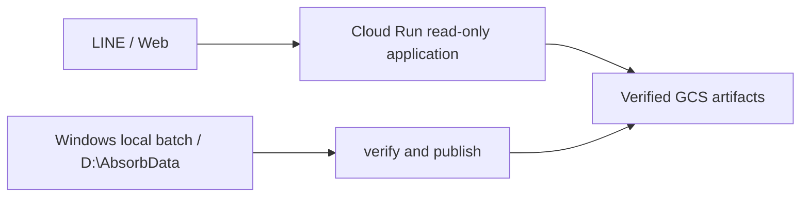

# ABSORB

ABSORB 是以 LINE 為主要操作入口、Web 為研究與展示介面的 AI 量化市場情報與決策輔助系統。它整合五日方向模型、歷史回測、技術面、籌碼、新聞情緒、產業資料與已驗證報告；缺資料時明確降級，不以 SAMPLE 或推測補位。

## 產品邊界

- LINE：股票查詢、固定指令、關注、提醒與自然語言研究問答。
- Web：市場、產業、個股、報告、LINE Login 與共用自然語言研究介面。
- Windows 本地：資料更新、模型、回測、PDF 與發布 candidate。
- Cloud Run：讀取已完成且驗證過的 artifacts；request 與 import 期間不執行重型分析。



## 品牌與設計

- 唯一 canonical Logo：`static/brand/absorb-mark.png`。
- 視覺與元件規則：[DESIGN.md](DESIGN.md)。
- 圖形保持原始輪廓、白底與安全邊距，不重畫、不加字、不裁切。
- 新 Web、LINE 與 report producer 只顯示 ABSORB；歷史 immutable 產物不改寫。

## 安裝與本機測試

需求：Python 3.10+、PowerShell、Git。依目前部署方式安裝 `requirements.txt`，再設定必要環境變數。

```powershell
python -m pip install -r requirements.txt
python -m unittest discover -s tests -v
python -m compileall -q absorb stock_papi reporting backtest
node --check static/app.js
```

開發伺服器預設只監聽 loopback：

```powershell
python app.py
```

## 設定

`.env.example` 只列新名稱。品牌化設定的讀取規則是：

1. `ABSORB_*` 優先。
2. migration period 可 fallback 到對應 `STOCK_PAPI_*`。
3. 新舊同時存在且值不同時 fail closed。
4. 錯誤與 log 不顯示值。

主要變數：

| 變數 | 用途 |
| --- | --- |
| `ABSORB_ENV` | 執行環境 |
| `ABSORB_DATA_ROOT` | 本機 canonical data root，預設 `D:\AbsorbData` |
| `ABSORB_REPORT_ROOT` | 本機報告目錄 |
| `LINE_CHANNEL_ACCESS_TOKEN` | LINE Messaging API 標準變數，名稱不改 |
| `LINE_CHANNEL_SECRET` | LINE webhook 驗證，名稱不改 |
| `GEMINI_API_KEY` | 自然語言規劃與 grounded answer |
| `GCP_PROJECT_ID` | GCP project |
| `QUANT_SNAPSHOT_BUCKET` | 已驗證快照 bucket |

所有 secrets 應由 Secret Manager 或部署平台注入，不提交 `.env`、key、token、cookie 或 service-account JSON。

## 固定 LINE 指令

固定指令仍由既有 deterministic handler 優先處理，不先呼叫 LLM，也不依賴 conversation context。實際 inventory 包含：

- `今日盤勢`、`大盤`、`大盤預測`
- `預測`、`熱門產業`、`產業列表`、`選產業_<名稱>`、`分類第_<頁碼>頁`
- `我的關注`、`強勢訊號`、`提醒管理`
- `完整分析`、`投資試算`、`試算 <代碼> <金額>`、`功能選單`
- `免責聲明`、`新手教學`
- 股票代碼／名稱查詢與既有 alert pending input

舊自然語言 prefix 在 migration period 仍可辨識，但不再顯示舊品牌或舊人格。

## 自然語言研究助理

一般文字在固定指令與股票直接查詢都不匹配後，才進入 `absorb/conversation/`：

```text
trusted transport identity
  -> TTL entity context
  -> LLM tool plan
  -> allowlisted application tools
  -> bounded normalized evidence
  -> grounded answer
  -> action-label validation
```

安全規則：

- LLM 不直接接觸 Firestore、GCS、SQL、本機檔案、shell、secrets 或任意 repository path。
- market、symbol、tool name、arguments、access、timeout、呼叫次數與輸出大小都由 server 驗證。
- `None` 保持 `None`；stale 顯示日期；核心資料不足時不提供進場／追價判斷。
- LINE 與 Web 共用 orchestrator、schema、context、tools、prompt 與 policy。
- Web context 使用 HttpOnly 隨機 cookie；LINE 使用 webhook event 的 user id；request body 的 user id 不可信。
- 不永久保存完整聊天紀錄，也不把完整問題寫入 log。

自然語言 watchlist 新增、移除、清空，以及建立提醒、關閉全部提醒，都會先建立綁定身分、canonical 參數、nonce、expiry 與 idempotency key 的 proposal，再呼叫既有狀態服務。確認碼不符、過期、重放或未登入時不執行。模糊的單筆提醒更新／刪除不猜測，改用既有「提醒管理」流程。

可觀測性只使用固定、無 label 的程序內計數器，例如自然語言請求、LLM 成功／錯誤、工具呼叫／錯誤、資料不足、過期資料、提示注入拒絕與寫入確認。Log 只記錄隨機 correlation ID，不記錄問題全文、使用者識別、股票代碼或工具參數。

## Python package migration

長期 canonical package 是 `absorb`。本階段已完成：

- `absorb` lightweight entry facade。
- 新 conversation、config 與 Web conversation route 實作位於 `absorb/`。
- 根入口 `app.py` 從 `absorb` 匯入。

既有量化、repository、LINE 與 report implementation 暫留 `stock_papi`，作為明確 compatibility boundary。原因是一次搬動 70+ 模組會放大 circular import、Flask endpoint、pickled type、task entry point 與 cold-start 風險。移除條件：所有 production entry points 已使用 `absorb`、兩個完整 release cycle 無 legacy import、歷史 artifact／pickle 讀取已驗證、所有外部 task 與 deployment 已切換。

## 本機資料遷移

舊 root 不 move、不刪除。先 dry-run，再 copy、hash verify，最後才切設定：

```powershell
.\scripts\migrate_stock_papi_data_to_absorb.ps1 -Copy -WhatIf
.\scripts\migrate_stock_papi_data_to_absorb.ps1 -Copy
.\scripts\migrate_stock_papi_data_to_absorb.ps1 -VerifyOnly
.\scripts\migrate_stock_papi_data_to_absorb.ps1 -SwitchConfig -WhatIf
```

Rollback 只把使用者層 `ABSORB_DATA_ROOT` 指回舊 root，不刪任何資料：

```powershell
.\scripts\migrate_stock_papi_data_to_absorb.ps1 -Rollback -WhatIf
```

## Windows Task Scheduler migration

新 task 使用 `ABSORB-*`，由舊 task XML 建立 disabled shadow；不自動刪舊 task：

```powershell
.\scripts\migrate_stock_papi_tasks_to_absorb.ps1 -Mode Inventory
.\scripts\migrate_stock_papi_tasks_to_absorb.ps1 -Mode InstallShadow -WhatIf
.\scripts\migrate_stock_papi_tasks_to_absorb.ps1 -Mode Cutover -ConfirmCutover -WhatIf
.\scripts\migrate_stock_papi_tasks_to_absorb.ps1 -Mode Rollback -WhatIf
```

Cutover 前必須比對 action、working directory、principal、retry、IgnoreNew、Limited run level、candidate 與已驗證輸出。

## Reports

新 writer 使用 `ABSORB` title、`absorb-*` local filename、`absorb-report` 與 `absorb-report-index` kind。reader 與 uploader 在 migration period 同時接受舊 `stock-papi-report*` kind。正式發布順序維持 immutable object -> metadata -> index -> latest；失敗不得覆蓋上一份成功的 latest。

## 外部 cutover

下列操作不由 repository commit 自動完成，必須在維護窗口逐項核准：

- GitHub repository rename、origin、Actions、webhook、badge、branch protection。
- 新 Cloud Run service、shadow deploy、domain／callback、traffic cutover 與停舊 service。
- Secret Manager 名稱與 deployment bindings。
- GCS／Firestore 新資源或 provider switch。
- LINE profile image、rich menu、display name 與 callback。
- 啟用新 Windows tasks、停用或刪除舊 tasks、刪除舊 data root 或 compatibility shims。

完整設計、cutover 與 rollback 邊界見：

- `docs/specs/2026-07-15-absorb-rebrand-conversation-design.md`
- `docs/plans/2026-07-15-absorb-rebrand-conversation-plan.md`
- `docs/deployment_guide.md`
- `docs/dual-daily-report-runbook.md`
- `docs/absorb-cutover-checklist.md`
