# Stock Papi 技術架構總覽

## 系統邊界

Cloud Run 提供 Flask、LINE webhook 與 Web 查詢；全市場資料取得、特徵、回測與發布都在 Windows 本機批次完成。Cloud Run 不在 webhook 路徑中訓練模型或重跑全市場。

```mermaid
flowchart LR
  A["市場資料與發布時間"] --> B["Data Layer"]
  B --> C["Feature Layer"]
  C --> D["Signal Layer"]
  D --> E["Execution Layer"]
  E --> F["Portfolio Layer"]
  F --> G["Analytics Layer"]
  G --> H["本機 artifact"]
  H --> I["GCS object"]
  I --> J["GCS manifest"]
  J --> K["GCS latest 指標"]
  K --> L["Cloud Run 驗證讀取與降級"]
```

## 回測六層

| 層級 | 模組 | 邊界 |
| --- | --- | --- |
| Data | `backtest/data.py`、`contracts.py` | `market_time`、`data_available_time`、`tradable_at` 與 Universe 狀態 |
| Feature | `backtest/features.py` | 僅使用 cutoff 前可得資料，拒絕看穿未來 |
| Signal | `backtest/signals.py` | 輸出時點正確的訊號，不假設成交 |
| Execution | `backtest/execution.py` | 次一可交易時點、成本、滑價、停牌與零量拒絕 |
| Portfolio | `backtest/portfolio.py` | 僅依已成交 execution 更新現金與持倉 |
| Analytics | `backtest/analytics.py` | 成本前後報酬、MDD、Sharpe、換手與交易數 |

`validation.py` 提供 walk-forward 與 OOS 隔離；`parity_checker.py` 對齊新舊特徵、機率、交易與績效。任何 Stage 1 特徵或 OOS 機率差異都是拒收條件。

## 快照與發布

目前實際量化發布格式位於私有 bucket 的 `quant/v1`：

- `objects/<sha256>.json.gz`：不可變個股或市場洞察內容。
- `manifests/<market>-<run>-<sha>.json`：市場 manifest，記錄覆蓋率與 object 雜湊。
- `latest-TW.json`、`latest-US.json`、`latest-insights.json`：最後更新的正式讀取指標。

`backtest/publish.py` 與 `rollback.py` 的 Phase 3B 通用 `manifest.json`／LKG 介面目前是獨立骨架。接入現行 `quant/v1/latest-<market>.json` 前，不得將其視為現行正式控制面。

## 監控與營運事件

`backtest/monitoring.py` 定義新鮮度、批次耗時、覆蓋率、schema drift、Gate 失敗與 yfinance 連續失敗指標。缺少資料時使用 `MetricGapMarker`，不補造歷史值。

`safe_publish()` 與 `RollbackWorkflow` 可接受可選 `event_sink`，輸出 `VALIDATION_FAILED`、`PUBLISHED`、`PIPELINE_FAILED`、`ROLLBACK_TRIGGERED` 與 `ROLLBACK_FAILED`。將 `AlertRouter.route_event` 傳入 runner 後，才會產生正式營運通知。

## 信任邊界

- Secret Manager 僅保存憑證值；日誌、報告與 artifact 不得輸出 secret。
- GCS object 必須先驗證大小、SHA-256、gzip、schema、日期與市場覆蓋率。
- 本機資料根目錄固定為 `D:\StockPapiData`，排程使用 Limited run level 與私有 ACL。
- Cloud Run 僅讀取已驗證快照；失敗時沿用既有即時計算或中性降級，不改寫 GCS。
